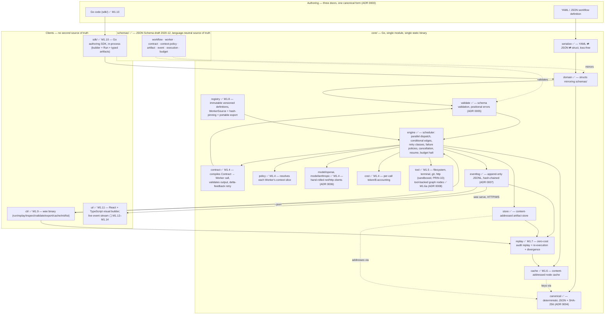
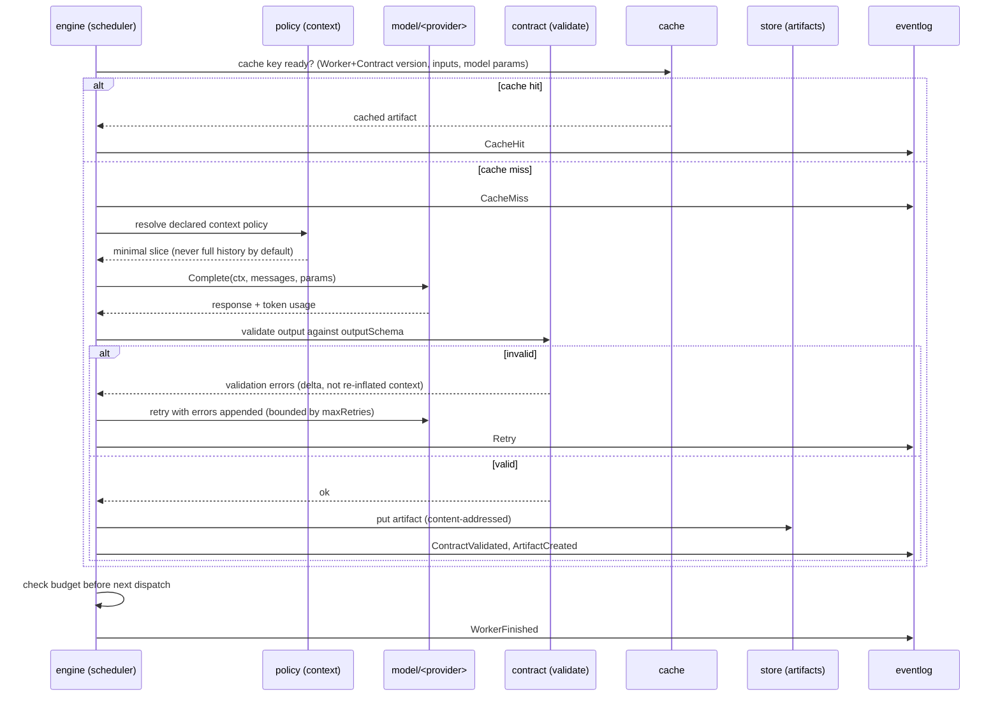

# Architecture — Workflow Execution Engine

> Non-normative, like [VISION.md](VISION.md), whose "Architecture at a glance" section this expands into
> diagrams. This is the **as-built and as-planned map of the system**, kept current as milestones land —
> when it drifts from `core/`, trust the code and fix this file in the same commit. The binding boundaries
> (Go vs TypeScript, one provider interface, no vendor SDKs, hash-chained log) are ADRs; this file just
> draws them.

## Component map

Two languages, one boundary — Go below the event stream, TypeScript only in `ui/` (ADR 0002). Nodes marked
`✅` exist today (M1.0–M1.11); `▢` are specified but not yet built, tagged with the milestone that delivers
them.

## Execution lifecycle (single node)

What happens once the engine dispatches a Worker — the loop that PRIN-05 (token economy) and PRIN-08
(anti-slop) are enforced inside:

## Reading this diagram against the specs

| Diagram element | Governing spec |
|---|---|
| Parallel dispatch, conditional edges, retry classes, failure policy, cancellation, resume | [spec/runtime.md](spec/runtime.md) |
| `contract` compile/validate/retry loop | [spec/contracts.md](spec/contracts.md) |
| `policy` context slicing | [spec/context-policies.md](spec/context-policies.md) |
| `model/*` provider clients | [spec/model-providers.md](spec/model-providers.md), [ADR 0006](adr/0006-model-provider-integration.md) |
| `cache` key + hit/miss/invalidation | [spec/cache.md](spec/cache.md) |
| `cost` accounting | [spec/budgets.md](spec/budgets.md) (REQ-BUDGET-03) |
| `tool` sandboxing | [spec/tools.md](spec/tools.md), [spec/security.md](spec/security.md) |
| `store` / content addressing | [spec/artifacts.md](spec/artifacts.md), [ADR 0004](adr/0004-content-addressing.md) |
| `eventlog` catalog + hash chain | [spec/events.md](spec/events.md), [ADR 0007](adr/0007-event-log-hash-chain.md) |
| `replay` | [spec/replay.md](spec/replay.md) |
| `registry` / versioning | [spec/versioning.md](spec/versioning.md) |
| `cli/`, `sdk/`, `ui/` | [spec/cli.md](spec/cli.md), [spec/sdk.md](spec/sdk.md), [spec/ui.md](spec/ui.md) |

## The flagship graph, for scale

The component map above is the engine; the shape it's built to run well is the flagship demo — see
[VISION.md → Flagship Demo](VISION.md#flagship-demo) for the PR Review & Auto-Fix graph (3 parallel
reviewers, each context-policy-scoped to the diff, feeding a Fixer → Test Runner → Commit). That graph
exercises every box above at once: parallel dispatch, context policies, contract enforcement, cache,
budget, and the event stream the UI renders live.
